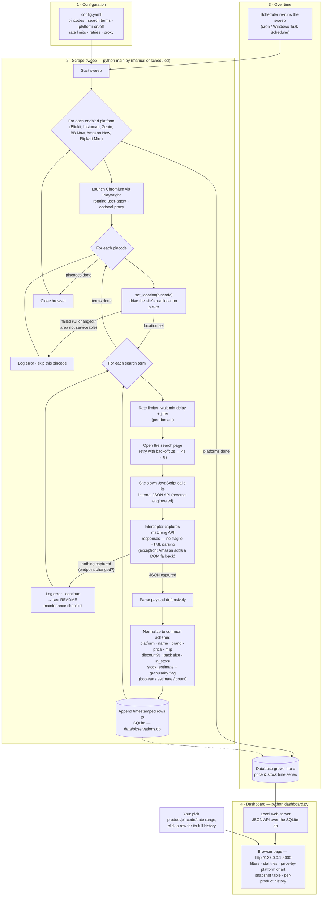

# End-to-end process flowchart

How a scrape run flows from configuration to the dashboard. GitHub renders
this diagram automatically; the same picture in words is in the README's
Architecture section.

